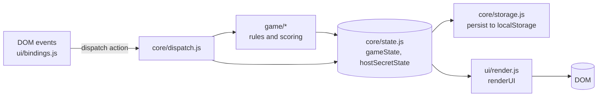

# Architecture

## Overview

A single-page app made of native ES modules. There is no bundler and no framework; `index.html` loads `js/main.js`, which imports everything else.

## Control flow

1. A DOM event calls `dispatch({ type, payload })`.
2. `dispatch` (a large `switch`) calls into `game/` for rules, mutates `gameState`, then calls `commitState()`.
3. `commitState()` persists the state and calls `renderUI()`, which shows the screen for `gameState.phase`.

Phases: `welcome → setup → reveal → timer → vote → (wager) → (guess) → result → leaderboard`. The timer can be re-entered when a caught spy leaves others in play.

## State model

| Object | Persisted | Purpose |
| :--- | :--- | :--- |
| `gameState` | yes | Everything visible to the table: phase, players, scores, settings, timer seconds. |
| `hostSecretState` | yes | Secrets only the host device holds: secret word, roles, votes cast, wagers. Serialised separately. |
| `session` | no | Ephemeral UI state (open role card, hand-off progress, pending confirmation). |

`gameState` and `hostSecretState` are exported `const` objects. Restoring a save uses `replaceGameState()` / `replaceHostSecrets()`, which swap the contents **in place**, so every module keeps a valid reference. Saves are versioned (`SAVE_VERSION`); a mismatch discards the save instead of loading incompatible data.

The countdown never compares wall-clock times. `gameState.timer.pausedSec` is decremented once per tick, so reloading, backgrounding, or pausing cannot make time jump.

## Modules

| Layer | Modules | Notes |
| :--- | :--- | :--- |
| `core/` | `config`, `state`, `storage`, `dispatch` | `config` is pure data plus two pure functions. |
| `game/` | `timer`, `rounds`, `voting`, `resolution`, `ranking` | `ranking` is pure and unit-tested; the rest read and write `gameState`. |
| `ui/` | `render`, `results`, `setup`, `wheel`, `handoff`, `scorecard`, `customWords`, `bindings`, `feedback`, `focusTrap`, `theme` | All DOM code lives here (plus `timer.js` for the countdown text). |
| `platform/` | `audio`, `wakeLock`, `antiZoom`, `install`, `serviceWorker` | Browser capabilities. |
| `data/`, `utils/` | word bank, side quests, help texts; text and random helpers | `utils/` and `data/` are pure and unit-tested. |

## Service worker

See the README section on offline-first updates. In short: `scripts/build.mjs` hashes all shipped files into `sw.js`; the worker precaches them (bypassing the HTTP cache), serves them cache-first, and deletes older caches on activate. Cross-origin Google Fonts use a separate stale-while-revalidate cache that survives updates.

## Known trade-offs

- **Import cycles.** `dispatch` calls into `game/` and `ui/`, which call `dispatch` back. All modules in the cycle only export functions and nothing runs at import time except `main.js`, so this is safe, but it is not a clean layering. The roadmap lists an event-based alternative.
- **Some game logic reads the DOM directly** (for example `ui/setup.js` validates the form and writes settings in one step). Separating parsing from validation would allow more unit tests.
- **`style-src 'unsafe-inline'`** is still required because a few HTML templates built in JS carry inline `style` attributes. Scripts are locked to `'self'`.
- **`frame-ancestors` cannot be set** from a `<meta>` CSP, and GitHub Pages does not allow custom headers, so clickjacking protection is not available on that host.
