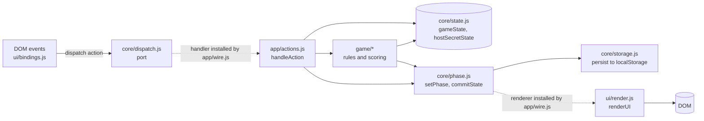

# Architecture

## Overview

A single-page app made of native ES modules. There is no bundler and no framework; `index.html` loads `js/main.js`, which imports everything else.

## Control flow


```mermaid
flowchart LR
    UI[DOM events<br/>ui/bindings.js] -->|dispatch action| D[core/dispatch.js<br/>port]
    D -.->|handler installed by app/wire.js| H[app/actions.js<br/>handleAction]
    H --> G[game/*<br/>rules and scoring]
    G --> S[(core/state.js<br/>gameState, hostSecretState)]
    H --> S
    H --> PH[core/phase.js<br/>setPhase, commitState]
    G --> PH
    PH --> P[core/storage.js<br/>persist to localStorage]
    PH -.->|renderer installed by app/wire.js| R[ui/render.js<br/>renderUI]
    R --> DOM[(DOM)]
```

1. A DOM event calls `dispatch({ type, payload })`. `dispatch` lives in `core/dispatch.js` and only forwards to a handler.
2. The handler is `handleAction` in `app/actions.js` (a large `switch`), installed by `wireApp()` from `main.js`. It calls into `game/` for rules, mutates `gameState`, then calls `commitState()`.
3. `commitState()` (in `core/phase.js`) calls the installed renderer, `renderUI()`, which shows the screen for `gameState.phase`, and then persists the state.

Dotted arrows are the two injected links; everything else is a plain `import`.

Phases: `welcome → setup → reveal → timer → vote → (wager) → (guess) → result → leaderboard`. The timer can be re-entered when a caught spy leaves others in play.

## State model

| Object | Persisted | Purpose |
| :--- | :--- | :--- |
| `gameState` | yes | Everything visible to the table: phase, players, scores, settings, timer seconds. |
| `hostSecretState` | yes | Secrets only the host device holds: secret word, roles, votes cast, wagers. Serialised separately. |
| `session` | no | Ephemeral UI state (open role card, hand-off progress, pending confirmation). |

`gameState` and `hostSecretState` are exported `const` objects. Restoring a save uses `replaceGameState()` / `replaceHostSecrets()`, which swap the contents **in place**, so every module keeps a valid reference. Saves are versioned (`SAVE_VERSION`); a mismatch discards the save instead of loading incompatible data.

The countdown never compares wall-clock times. `gameState.timer.pausedSec` is decremented once per tick, so reloading, backgrounding, or pausing cannot make time jump.

## Modules

| Layer | Modules | Notes |
| :--- | :--- | :--- |
| `app/` | `actions`, `wire` | The action handler (the big `switch`) and the composition root. Only `wire` imports `actions`, and only `main.js` imports `wire`. |
| `core/` | `config`, `state`, `storage`, `phase`, `dispatch` | `config` is pure data plus two pure functions. `dispatch` is a port and `phase` holds `setPhase` and `commitState`; neither imports `game/`, `ui/` or `app/`. |
| `game/` | `timer`, `rounds`, `voting`, `resolution`, `ranking` | `ranking` is pure and unit-tested; the rest read and write `gameState`. |
| `ui/` | `render`, `results`, `setup`, `wheel`, `handoff`, `scorecard`, `customWords`, `bindings`, `feedback`, `focusTrap`, `theme` | All DOM code lives here (plus `timer.js` for the countdown text). |
| `platform/` | `audio`, `wakeLock`, `antiZoom`, `install`, `serviceWorker` | Browser capabilities. |
| `data/`, `utils/` | word bank, side quests, help texts; text and random helpers | `utils/` and `data/` are pure and unit-tested. |

## Dependency direction

```text
main.js -> app/wire.js -> app/actions.js -> game/, ui/, platform/, data/, utils/, core/
game/, ui/ -> core/dispatch.js (port), core/phase.js, core/state.js, ...
core/dispatch.js, core/phase.js -> core/state.js, core/storage.js, core/config.js, platform/wakeLock.js, data/
```

Two things used to point upward from `core/` into `game/` and `ui/`, which is what made the cycles. Both are now injected by `app/wire.js` when the app starts:

| Seam | Lives in | Filled with | Why it is a seam |
| :--- | :--- | :--- | :--- |
| `dispatch(action)` | `core/dispatch.js` (`setDispatchHandler`) | `handleAction` from `app/actions.js` | The handler needs every module, and those modules need to dispatch. |
| `commitState()` renders | `core/phase.js` (`setRenderer`) | `renderUI` from `ui/render.js` | `commitState` and `setPhase` are called by `game/`, and rendering reads `game/`. |
| `setPhase()` pre-hook | `core/phase.js` (`setBeforePhaseChange`) | `stopTimerWhenLeavingTimerPhase` from `game/timer.js` | The timer calls `setPhase`, and `setPhase` has to stop the timer when leaving the timer screen. |

The seams are plain synchronous callbacks rather than `EventTarget` events on purpose: calls stay re-entrant (an action can dispatch another action) and an exception still reaches the caller, exactly as with a direct call. An unconnected seam throws instead of doing nothing, so a forgotten `wireApp()` fails loudly.

`tests/unit/import-cycles.test.mjs` reads every `import` under `js/` and fails on any cycle, on an import of a missing file, and on `core/` importing from `game/`, `ui/` or `app/`. `tests/unit/phase.test.mjs` covers the seams themselves.

## Service worker

See the README section on offline-first updates. In short: `scripts/build.mjs` hashes all shipped files into `sw.js`; the worker precaches them (bypassing the HTTP cache), serves them cache-first, and deletes older caches on activate. Cross-origin Google Fonts use a separate stale-while-revalidate cache that survives updates.

## Known trade-offs

- **`game/` and `ui/` still know each other.** There are no import cycles between files, but some helpers are shared across the folders in both directions (for example `game/timer.js` calls `ui/render.js` to draw the countdown, and `ui/render.js` reads `game/voting.js`). Only `core/` is kept strictly below them.
- **Some game logic reads the DOM directly** (for example `ui/setup.js` validates the form and writes settings in one step). Separating parsing from validation would allow more unit tests.
- **`style-src 'unsafe-inline'`** is still required because a few HTML templates built in JS carry inline `style` attributes. Scripts are locked to `'self'`.
- **`frame-ancestors` cannot be set** from a `<meta>` CSP, and GitHub Pages does not allow custom headers, so clickjacking protection is not available on that host.
