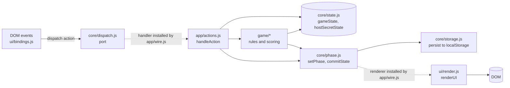

# Architecture

## Overview

A single-page app made of native ES modules. There is no bundler and no framework; `index.html` loads `js/main.js`, which imports everything else.

## Control flow


```mermaid
flowchart LR
    UI[DOM events<br/>ui/bindings.js] -->|dispatch action| D[core/dispatch.js<br/>port]
    D -.->|handler installed by app/wire.js| H[app/actions.js<br/>handleAction]
    H --> G[game/*<br/>rules and scoring]
    G --> S[(core/state.js<br/>gameState, hostSecretState)]
    H --> S
    H --> PH[core/phase.js<br/>setPhase, commitState]
    G --> PH
    PH --> P[core/storage.js<br/>persist to localStorage]
    PH -.->|renderer installed by app/wire.js| R[ui/render.js<br/>renderUI]
    R --> DOM[(DOM)]
```

1. A DOM event calls `dispatch({ type, payload })`. `dispatch` lives in `core/dispatch.js` and only forwards to a handler.
2. The handler is `handleAction` in `app/actions.js` (a large `switch`), installed by `wireApp()` from `main.js`. It calls into `game/` for rules, mutates `gameState`, then calls `commitState()`.
3. `commitState()` (in `core/phase.js`) calls the installed renderer, `renderUI()`, which shows the screen for `gameState.phase`, and then persists the state.

Dotted arrows are the two injected links; everything else is a plain `import`.

Phases: `welcome → setup → reveal → timer → vote → (wager) → (guess) → result → leaderboard`. The timer can be re-entered when a caught spy leaves others in play.

## State model

| Object | Persisted | Purpose |
| :--- | :--- | :--- |
| `gameState` | yes | Everything visible to the table: phase, players, scores, settings, timer seconds. |
| `hostSecretState` | yes | Secrets only the host device holds: secret word, roles, votes cast, wagers. Serialised separately. |
| `session` | no | Ephemeral UI state (open role card, hand-off progress, pending confirmation). |

`gameState` and `hostSecretState` are exported `const` objects. Restoring a save uses `replaceGameState()` / `replaceHostSecrets()`, which swap the contents **in place**, so every module keeps a valid reference. Saves are versioned (`SAVE_VERSION`); a mismatch discards the save instead of loading incompatible data. A save also records the language of its match in `gameState.match.lang` (an optional field, so it did not need a new version; see [A match keeps its language](#a-match-keeps-its-language)).

The countdown never compares wall-clock times. `gameState.timer.pausedSec` is decremented once per tick, so reloading, backgrounding, or pausing cannot make time jump.

## Modules

| Layer | Modules | Notes |
| :--- | :--- | :--- |
| `app/` | `actions`, `wire` | The action handler (the big `switch`) and the composition root. Only `wire` imports `actions`, and only `main.js` imports `wire`. |
| `core/` | `config`, `state`, `storage`, `phase`, `dispatch` | `config` is pure data plus two pure functions. `dispatch` is a port and `phase` holds `setPhase` and `commitState`; neither imports `game/`, `ui/` or `app/`. |
| `game/` | `timer`, `rounds`, `voting`, `resolution`, `ranking` | `ranking` is pure. `timer`, `rounds`, `voting` and `resolution` read and write `gameState`; they are unit-tested against the fake browser in `tests/unit/helpers/`. |
| `ui/` | `render`, `results`, `setup`, `wheel`, `handoff`, `scorecard`, `customWords`, `bindings`, `feedback`, `focusTrap`, `langSwitch`, `theme` | All DOM code lives here (plus `timer.js` for the countdown text). |
| `platform/` | `audio`, `wakeLock`, `antiZoom`, `install`, `serviceWorker` | Browser capabilities. |
| `i18n/` | `index`, `catalogs`, `fa`, `en` | Translation core and the Persian and English catalogs (see [Translations](#translations)). It imports nothing from `game/`, `ui/` or `app/`. |
| `js/` root | `main`, `preinit` | `main` is the module entry. `preinit` is a classic script loaded from `<head>` that is not part of the module graph (see [First paint in another language](#first-paint-in-another-language)). |
| `data/`, `utils/` | word banks and side quests (one pair per language, `data/banks.js` picks by language code), help-text keys; text and random helpers | `utils/` and `data/` are pure and unit-tested. `data/` imports nothing outside `data/` (the language is passed in as an argument, never read from `i18n/`). |

## Dependency direction

```text
main.js -> app/wire.js -> app/actions.js -> game/, ui/, platform/, data/, utils/, core/
game/, ui/ -> core/dispatch.js (port), core/phase.js, core/state.js, ...
core/dispatch.js, core/phase.js -> core/state.js, core/storage.js, core/config.js, platform/wakeLock.js, data/
core/, ui/, game/, platform/, app/, utils/text.js -> i18n/index.js (t, tn, tHtml, setTemplate, formatNumber, formatList, ...)
game/rounds.js -> data/banks.js (getWordPacks(lang), getSideQuests(lang)); data/ -> data/ only
i18n/index.js -> i18n/catalogs.js -> i18n/fa.js, i18n/en.js (nothing else)
```

Two things used to point upward from `core/` into `game/` and `ui/`, which is what made the cycles. Both are now injected by `app/wire.js` when the app starts:

| Seam | Lives in | Filled with | Why it is a seam |
| :--- | :--- | :--- | :--- |
| `dispatch(action)` | `core/dispatch.js` (`setDispatchHandler`) | `handleAction` from `app/actions.js` | The handler needs every module, and those modules need to dispatch. |
| `commitState()` renders | `core/phase.js` (`setRenderer`) | `renderUI` from `ui/render.js` | `commitState` and `setPhase` are called by `game/`, and rendering reads `game/`. |
| `setPhase()` pre-hook | `core/phase.js` (`setBeforePhaseChange`) | `stopTimerWhenLeavingTimerPhase` from `game/timer.js` | The timer calls `setPhase`, and `setPhase` has to stop the timer when leaving the timer screen. |

The seams are plain synchronous callbacks rather than `EventTarget` events on purpose: calls stay re-entrant (an action can dispatch another action) and an exception still reaches the caller, exactly as with a direct call. An unconnected seam throws instead of doing nothing, so a forgotten `wireApp()` fails loudly.

`tests/unit/import-cycles.test.mjs` reads every `import` under `js/` and fails on any cycle, on an import of a missing file, and on `core/` or `i18n/` importing from `game/`, `ui/` or `app/`. `tests/unit/phase.test.mjs` covers the seams themselves. The game rules in `game/` are covered by `rounds`, `voting`, `resolution` and `timer` tests that pin current behaviour; they load the modules after `tests/unit/helpers/fakeEnv.mjs` has installed a minimal `window`, `document`, `localStorage` and a manual clock. Rendering, the wheel animation, sound and the full game flow in a real browser are not covered by unit tests.

## Translations

**Every text a player can see comes from `t(key)` (in JS) or from a `data-i18n` attribute (in `index.html`).** The catalogs in `js/i18n/` hold the texts; `fa.js` is the Persian one and the last fallback, `en.js` is the English one.

- **Catalog:** a flat object of dotted English keys grouped by screen (`setup.title`, `info.detective.text`). Values are plain text with optional `{name}` parameters, never HTML. `catalogs.js` lists every catalog, and the tests walk that list.
- **Tools.** `tn(key, count, params)` picks `key.one` / `key.other` (or the other plural categories) by `Intl.PluralRules` of the active language and fills `{count}` with `formatNumber(count)`; Persian has the same text in both forms. `formatNumber(n)` writes the digits of the language (table `NUMERALS`, next to `LANG_DIRECTIONS`). `formatDuration(seconds)` uses `time.minutes.*`, `time.seconds.*` and `time.minutesAndSeconds`, so the language decides the wording and the order. `formatList(items)` (and `formatListHtml(items)` for items that are already safe HTML, such as a name in `<bdi>`) writes "A, B and C": two items use `names.pair`, three or more chain `names.list.separator` and finish with `names.list.last`, each a `{a}` / `{b}` template, so the language decides the separator and the last word (English "A, B and C", Persian "A و B و C"). It is catalog-driven on purpose, not `Intl.ListFormat`, so Persian stays exactly what it was. `setTemplate(element, key, slots, params)` writes one whole sentence into an element without `innerHTML`: each `{name}` is replaced by a node or a string from `slots`, the rest is text, `{br}` is a line break. `tHtml` / `tnHtml` do the same for an HTML string, escaping the catalog text and every parameter except one wrapped in `rawHtml()`.
- **No Persian in the code.** A sentence that holds a name or a number is one template (`{name}`, `{count}`); the markup around a name stays in the code and the catalog never has any. `tests/unit/no-hardcoded-text.test.mjs` fails on any Persian letter, digit or comment under `js/` except `data/`, `i18n/` and a short, commented list of input-normalisation lines in `utils/text.js`.
- **`t(key, params)`** looks in the active language, then in Persian, then returns the key itself. It never interprets HTML and never escapes anything: put its result (or a parameter) into `innerHTML` only after `escapeHtml`. `textContent` needs no escaping.
- **Static HTML keeps its Persian text.** The text written in `index.html` is the default, so the first paint, the offline path and the Persian experience never wait for JS. An element gets `data-i18n="key"` (replaces its whole `textContent`, so leaf elements only; if the text sits next to other children, wrap it in `<span data-i18n="key">`) or `data-i18n-attr="aria-label:key;placeholder:key"` for attributes. `<title>` and `<meta name="description">` use the same attributes.
- **Start-up and switching.** `initI18n()` runs first in `main.js`: it reads the saved language (`localStorage` key `spy_lang`) and translates the static HTML only if that language is not the default. Before that, for a saved language that is not the default, `js/preinit.js` has already set `<html lang dir>` and a class that hides the page until `initI18n()` is done (see [First paint in another language](#first-paint-in-another-language)). `setLang(lang)` ignores an unsupported language; otherwise it saves the choice, sets `<html lang dir>`, translates the static HTML (always, so going back to Persian works) and tells the `onLangChange` listeners.
- **Elements JS writes.** Some elements in `index.html` have Persian default text that JS overwrites on every use (the hand-over gate, the role card, the result title, the elimination reveal, and so on). They carry no `data-i18n`; JS writes their texts from the catalog (and a sentence with a name is one element that `setTemplate` fills). `tests/unit/i18n-html.test.mjs` keeps that list explicit (`JS_WRITTEN`, with the catalog keys each element receives, and which default equals which text) and fails on any other Persian text in `index.html` that is not translatable.

`tests/unit/i18n-format.test.mjs` covers the tools above (plurals, digits, durations, templates, the HTML variants, with a fake second language). `tests/unit/i18n.test.mjs` covers `t`, the fallback chain, `setLang`, `initI18n` and the static translator. `tests/unit/i18n-html.test.mjs` checks that every key in the HTML exists, that the Persian text in `index.html` equals the catalog value (so the two sources cannot drift apart), that all catalogs have the same keys and placeholders, and that no catalog key is unused.

### Direction (LTR / RTL) and locale

The direction comes from the language (`LANG_DIRECTIONS`, written to `<html dir>` by `setLang`). CSS reads it from `<html dir>`; JS asks `getDirection()`; `Intl` and dates ask `getLocale()` / `formatDate()` (`LANG_LOCALES`). Nothing in the code assumes a side.

- **CSS uses logical properties.** `text-align: start`, `margin-inline-*`, `padding-inline`, `inset-inline-*`; flex and grid already follow the direction. An offset that must flip is written `calc(Npx * var(--dir))` (`--dir` is `1` on `:root` and `-1` under `:root[dir="rtl"]`): the toggle knob, the pass-the-phone icon, the ambient glow drift. A layout that must differ per direction gets a `:root[dir="rtl"]` override (the podium order; silver, gold, bronze reads left to right in both; the two floating buttons, whose inline edge swaps sides, read the safe-area inset of the physical side they are on). `tests/unit/css-direction.test.mjs` fails on any physical left/right declaration that is not on its short, commented allow-list (safe-area insets, the play triangle, the centred toast), so a new rule cannot reintroduce one.
- **Player names are user text in either script,** so a name never sits next to text without isolation: in an HTML string wrap it in `<bdi>`; an element that holds only a name (a field, a card, a title, an inline `<strong>`) gets `unicode-bidi: plaintext` (see the rule in `style.css`); in a plain-text sentence wrap it with `isolate(name)` (U+2068 ... U+2069). Do not use `plaintext` on a table cell or a heading: an element with no letter of its own (a cell that holds just a `<bdi>`) is resolved as LTR by Chrome, which flips its alignment. `<bdi>` keeps the page direction there.
- **The scorecard canvas** takes the direction from `getDirection()`: `ctx.direction`; the columns of the "other players" rows (`computeRestRowColumns(layout, direction)`, pure, exactly mirrored for LTR); the bidi marks (`isolateLine`: RLI for RTL, which is what the Persian image always used, LRI for LTR, one per line, plus `isolate()` per name; `balanceIsolates` closes a name that a line wrap or an ellipsis cut); and the date (`formatDate`). The podium and all centred text are direction-neutral. Pure layout functions get the direction as an argument.
- **Digits.** `formatNumber` follows `NUMERALS`. A few Persian places keep Latin digits on purpose (they pass `{count}` or the value as text themselves); English is Latin everywhere.
- **Not covered by a language yet:** `manifest.json` (`lang`, `dir`) and the `og:*` and Twitter meta tags in `index.html` (crawlers do not run JS, so they stay Persian).

### A match keeps its language

A running match stores texts in the language it was started in (the role hint titles and hints, the category label, the detective's answer), and its secret word comes from that language's word bank. So **the language must not change under a match.**

- `startNextRound` writes `getLang()` into `gameState.match.lang`; the save (`persist`) carries it.
- `RESTORE_GAME` (in `app/actions.js`) reads it with `normalizeLang()` and calls `setLang()` **before** `replaceGameState` and the first render, so the restored game and the UI agree. A save with no `match.lang` (every save made before it existed) is Persian; an unsupported or malformed value is ignored the same way. A save that is rejected (another `SAVE_VERSION`) leaves the language alone. `SAVE_VERSION` was not bumped: the field is optional and old saves restore unchanged.
- `setLang` also saves the choice under `spy_lang`, so restoring a match in a language other than the saved preference makes that language the preference. That is deliberate: there is one stored value, no separate "preferred" one, and the language switch changes it too.
- **The language can only change outside a match** (see [The language switch](#the-language-switch)). `startNextRound` uses the active language for the next round, so a switch mid-match would mix languages inside one match.
- `main.js` listens with `onLangChange` and redraws what JS writes only once (see [The language switch](#the-language-switch)).

**Stored text that must not freeze in one language.** Two kinds of user data hold a default that a language wrote:

- *Player names* (`spy_saved_player_names`). A name that is just the default of a slot in ANY supported language is not saved (`''` is saved, so the slot keeps its place) and is read as "no saved name" when loaded (`isDefaultPlayerName` in `core/storage.js`, built from `setup.player.default` with `{n}` as any number). A typed name is kept as is. The check does not compare the number with the slot, so a language's `setup.player.default` must keep its `{n}`.
- *Custom words.* No hint is stored as `''`. `displayHint()` words an empty hint, or a legacy stored one equal to `setup.hint.none` of any language, in the active language when it is shown or put on a role card.

### The language switch

A person changes the language with two buttons on the **welcome screen only** (not in the header, which is on every screen). Where each part lives:

| Part | File | What it does |
| :--- | :--- | :--- |
| Markup | `index.html` (`#screen-welcome`) | A `role="group"` (named by `welcome.lang.aria`) in a `dir="ltr"` wrapper, so the buttons keep the same visual order in both languages. One `button.lang-btn` per language with `id="btn-lang-<code>"`, `lang="<code>"`, `data-lang="<code>"` and `aria-pressed`. The labels ("فارسی", "English") are fixed text in their own language: no `data-i18n`, no catalog key. The page is Persian before JS runs, so only the Persian button starts pressed. |
| Style | `css/style.css` (`.lang-switch`, `.lang-btn`) | Logical properties only. The selected look is drawn from `[aria-pressed="true"]`, so what is shown and what a screen reader announces cannot disagree. Buttons are 44 px high. |
| Click | `ui/bindings.js` | `dispatch({ type: 'SET_LANG', payload: btn.dataset.lang })`, nothing else. |
| Action | `app/actions.js` (`SET_LANG`) | Ignores an unsupported value (`normalizeLang(value) !== value`, so `undefined`, an array, `'de'` and `'__proto__'` are ignored), ignores a request while `isMatchInProgress()` is true, ignores the language that is already active, otherwise calls `setLang`. It does not call `commitState`: nothing about the match changes. |
| Rule | `core/phase.js` (`isMatchInProgress`) | True in every phase except `welcome` and `setup`, an unknown phase included, and the final scoreboard too. The welcome screen with the recovery banner is not in progress, so the language can be changed there; **Resume match** then switches back to the language of the saved match (`RESTORE_GAME`). |
| Refresh | `main.js` (`refreshLanguageDependentUi`, an `onLangChange` listener) | `setLang` has already translated the static HTML (`data-i18n`, `data-i18n-attr`, `<title>`, the meta description, `<html lang dir>`, the theme options, the chips, the toggles, the recovery banner, the words modal's static texts). The listener redraws what JS writes only once: the pressed state of the switch (`syncLangSwitch` in `ui/langSwitch.js`), toasts on screen (`clearToasts`), the limit hints, the name inputs (`renderNameInputs(false, true)`, which updates the existing inputs in place) and the custom-word count and list. Because it listens to the language and not to the click, a language change that comes from restoring a match is covered too. |

Texts that are built when something opens (the info modals, the confirmation dialog, the role card, every screen after `renderUI`) read `t()` at that moment and need no refresh. A name the user typed is never changed; a slot that still holds the other language's default ("بازیکن 3" / "Player 3") gets the new default and keeps its player id.

`renderNameInputs` (`ui/setup.js`) **updates the inputs in place**: it keeps the existing elements, their values and their player ids, adds or removes only the slots at the end, and writes a value only when it changes. This is not only tidiness: the player-count field's `change` event fires when it loses focus, which on a phone is the moment the person taps a name input, and an implementation that redrew every input there deleted the tapped element, so the first tap focused nothing (`tests/e2e/lang-switch.test.mjs` taps with a mouse and with touch).

**A new language appears in the switch** when its button is added to the group in `index.html`: copy one `button.lang-btn`, change `id`, `lang`, `data-lang` and the label (the name of the language in itself), keep `aria-pressed="false"`, and list it in `FIXED_TEXT` in `tests/unit/i18n-html.test.mjs`, which also checks that there is exactly one button per entry of `SUPPORTED_LANGS`, in the same order. The buttons share the row (`flex: 1`), so a third one fits as it is; a long label may need a wrapping row in `css/style.css`. Everything else (catalog, direction, locale, word bank) is in [Adding a language](#adding-a-language).

#### First paint in another language

`index.html` is Persian, and the module graph takes a moment to arrive, so a person who chose English would first see the whole page in Persian, right to left (measured: about 400 ms on a local connection, longer on a slow one). `js/preinit.js` prevents that. It is a **classic script** (not a module, and not part of the module graph), loaded from `<head>` after the CSP and before the stylesheet, so it runs before the first paint. When `spy_lang` holds a supported language other than Persian it writes `<html lang dir>` and puts the class `i18n-pending` on `<html>`. `css/style.css` keeps `body` hidden while that class is there (the page background still shows, because it belongs to the canvas), and `initI18n()` removes the class after translating the static HTML, also when translating throws.

- **Safety net, no JS involved.** The same CSS rule has a zero-duration animation with a one-second delay that sets `visibility: visible`. If the class is still there after a second (`main.js` failed to load, or threw), the page appears anyway, so a JS failure can never leave a blank page.
- **The Persian path is untouched.** Persian, no saved language, an unsupported value, and a `localStorage` that throws or is missing do nothing in `preinit.js`: no class, nothing hidden, the same first paint as before.
- **It repeats two things it cannot import:** the direction table (`LANG_DIRECTIONS`) and the class name (`PAGE_PENDING_CLASS`). `tests/unit/preinit.test.mjs` runs the shipped file against every entry of `SUPPORTED_LANGS` and `LANG_DIRECTIONS`, so a language added in one place and not the other fails there; a new language needs a line in its table.
- `tests/e2e/first-paint.test.mjs` holds `main.js` back in a real browser and checks that the page is hidden and `<html>` is already English and LTR, that the page shows after `initI18n`, that the CSS alone shows it after about a second when `main.js` cannot load or throws, and that a Persian user sees the page at once.

### Adding a language

1. **Catalog.** Copy `js/i18n/en.js` to `js/i18n/<code>.js` and translate every value (including `names.pair`, `names.list.separator` and `names.list.last`). `setup.player.default` must keep `{n}` and `setup.hint.none` is the text legacy custom words are recognised by (see [A match keeps its language](#a-match-keeps-its-language)). Keep every key, every `{placeholder}` and every emoji; values stay plain text; every plural text needs `.one` and `.other` plus whatever other categories `Intl.PluralRules('<code>')` can return. Put a glossary comment at the top: one term per game idea, used everywhere (the English file is the model). Write for the language, not word for word: placeholders may move where the sentence needs them.
2. **Registry, direction and locale.** Import the catalog in `js/i18n/catalogs.js`, add the code to `SUPPORTED_LANGS`, its direction (`'rtl'` or `'ltr'`) to `LANG_DIRECTIONS` and its locale tag (`fa-IR`, `en-US`) to `LANG_LOCALES` in `js/i18n/index.js`. A language that writes its own digits also gets an entry in `NUMERALS`; one whose dates need options (a spelled-out month) gets an entry in `DATE_OPTIONS`.
3. **Word bank and side quests.** Copy `js/data/wordPacksEn.js` to `js/data/wordPacks<Code>.js` (the same 8 category ids, entries `{ word, foolWord, hint, diff }`, one array per category) and `js/data/sideQuestsEn.js` to `js/data/sideQuests<Code>.js` (one sentence per quest), then list both in `WORD_BANKS` and `QUEST_POOLS` in `js/data/banks.js`. A language with no entry there plays with the Persian words and quests. `data/` never imports `i18n/`: `rounds.js` passes `getLang()` in. The per-language rules in `tests/unit/data.test.mjs` (same categories, shape, length limits, no duplicates) run for every language in `DATA_LANGS` by themselves; add the language-specific ones (script, minimum counts as named constants) next to the English block. If the "all categories" label states a number, it must be that bank's size rounded down to a hundred, or leave the number out until the bank is that big.
4. **Build.** Nothing to do: `scripts/build.mjs` copies all of `js/` and puts every file in the service-worker precache, so the new catalog and data are available offline after the first visit.
5. **Tests.** The parity tests (`i18n-html.test.mjs`) walk `CATALOGS`, so a missing key or a changed placeholder fails at once. Copy `tests/unit/i18n-en.test.mjs` for the language-specific checks (script, plurals, digits, direction). A language that does not put "and" between the last two names needs its own `names.list.*` templates (and a test like `tests/unit/i18n-list.test.mjs`).
6. **Switch button.** Add the language's button to the switch on the welcome screen (see [The language switch](#the-language-switch)) and list it in `FIXED_TEXT` in `tests/unit/i18n-html.test.mjs`; without it nobody can choose the language in the UI.

## Service worker

See the README section on offline-first updates. In short: `scripts/build.mjs` hashes all shipped files into `sw.js`; the worker precaches them (bypassing the HTTP cache), serves them cache-first, and deletes older caches on activate. Cross-origin Google Fonts use a separate stale-while-revalidate cache that survives updates.

## Known trade-offs

- **`game/` and `ui/` still know each other.** There are no import cycles between files, but some helpers are shared across the folders in both directions (for example `game/timer.js` calls `ui/render.js` to draw the countdown, and `ui/render.js` reads `game/voting.js`). Only `core/` is kept strictly below them.
- **Some game logic reads the DOM directly** (for example `ui/setup.js` validates the form and writes settings in one step). Separating parsing from validation would allow more unit tests.
- **`style-src 'unsafe-inline'`** is still required because a few HTML templates built in JS carry inline `style` attributes. Scripts are locked to `'self'`.
- **`frame-ancestors` cannot be set** from a `<meta>` CSP, and GitHub Pages does not allow custom headers, so clickjacking protection is not available on that host.
